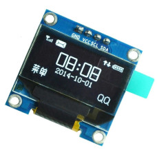

# Listado de componentes

| Componente                                                                                                                                | Imagen referencial                                                         |   Valor |
|-------------------------------------------------------------------------------------------------------------------------------------------|----------------------------------------------------------------------------|--------:|
| [Arduino Uno R3 ](https://www.mechatronicstore.cl/arduino-uno-r3/)                                                                        |                            | $15.690 |
| [Protoboard](https://www.mechatronicstore.cl/breadboard-830-puntos-mb102/)                                                                |                                |  $2.490 |
| [Fuente de Poder](https://maxelectronica.cl/fuentes-de-alimentacion/54-mini-fuente-de-poder-para-protoboard-con-salida-de-33v-y-5v.html)  |                           |  $2.990 |
| [Broche de batería 9V](https://www.mechatronicstore.cl/broche-de-bateria-9v-con-plug-dc-2-1mm/)                                           |                     |    $490 |
| [Bateria 9v](https://www.mercadolibre.cl/baterias-alcalinas-duracell-coppertop-blister-9v/p/MLC19902480)                                  |                                 |  $4.690 |
| [Matriz led 32x8 operado con un MAX7219](https://www.mechatronicstore.cl/Fmatriz-led-8x8x4-256-leds-max7219/)                             |                                   |  $6.890 |
| [Módulo Reloj RTC DS3231](https://www.mechatronicstore.cl/modulo-reloj-rtc-ds3231/)                                                       |                                    |  $3.490 |
| [Pila CR2032 o CR2040](https://articulo.mercadolibre.cl/MLC-956407083-pack-tira-5-pilas-tipo-boton-duracell-dlcr-2032-_JM) - (5 unidades) |                                   |  $3.325 |
| [Pantalla OLED SSD1306 0.96"](https://altronics.cl/display-oled-128x64-i2c)                                                               |                                  |  $6.800 |
| [Kit 6 Pinzas](https://www.mechatronicstore.cl/kit-6-pinzas-antimagneticas-antiestaticas-vetus/)                                          |                                    | $11.900 |
| [Limpiador para cautín](https://www.mechatronicstore.cl/limpiador-para-cautin/)                                                           |                                    |  $3.490 |
| [Kit de soldadura](https://www.mechatronicstore.cl/kit-de-soldadura-fina-con-cautin-regulable-pelacable-estano-y-mas/)                    |  | $14.990 |
| [Estaño soldadura](https://www.mechatronicstore.cl/rollo-soldadura-100g-1mm-40-60/)                                                       |                                    |  $4.990 |
| [Cable H/H 10 cm](https://www.mechatronicstore.cl/cable-hembra-hembra-40-piezas-10-cm/)                                                   |                                   |  $1.990 |
| [Cable H/H 20 cm](https://www.mechatronicstore.cl/cables-hembra-hembra-40-piezas-20cm/)                                                   |                                   |  $2.390 |
| [Cable M/H 10 cm](https://www.mechatronicstore.cl/cable-macho-hembra-40-piezas-10-cm/)                                                    |                                   |  $1.990 |
| [Cable M/H 20 cm](https://www.mechatronicstore.cl/cable-macho-hembra-40-piezas-20-cm/)                                                    |                                   |  $2.390 |
| [Cable M/M 10 cm](https://www.mechatronicstore.cl/cable-macho-macho-40-piezas-10cm/)                                                      |                                   |  $1.590 |
| [Cable M/M 20 cm](https://www.mechatronicstore.cl/cable-macho-macho-40-piezas-20cm/)                                                      |                                   |  $2.500 |

