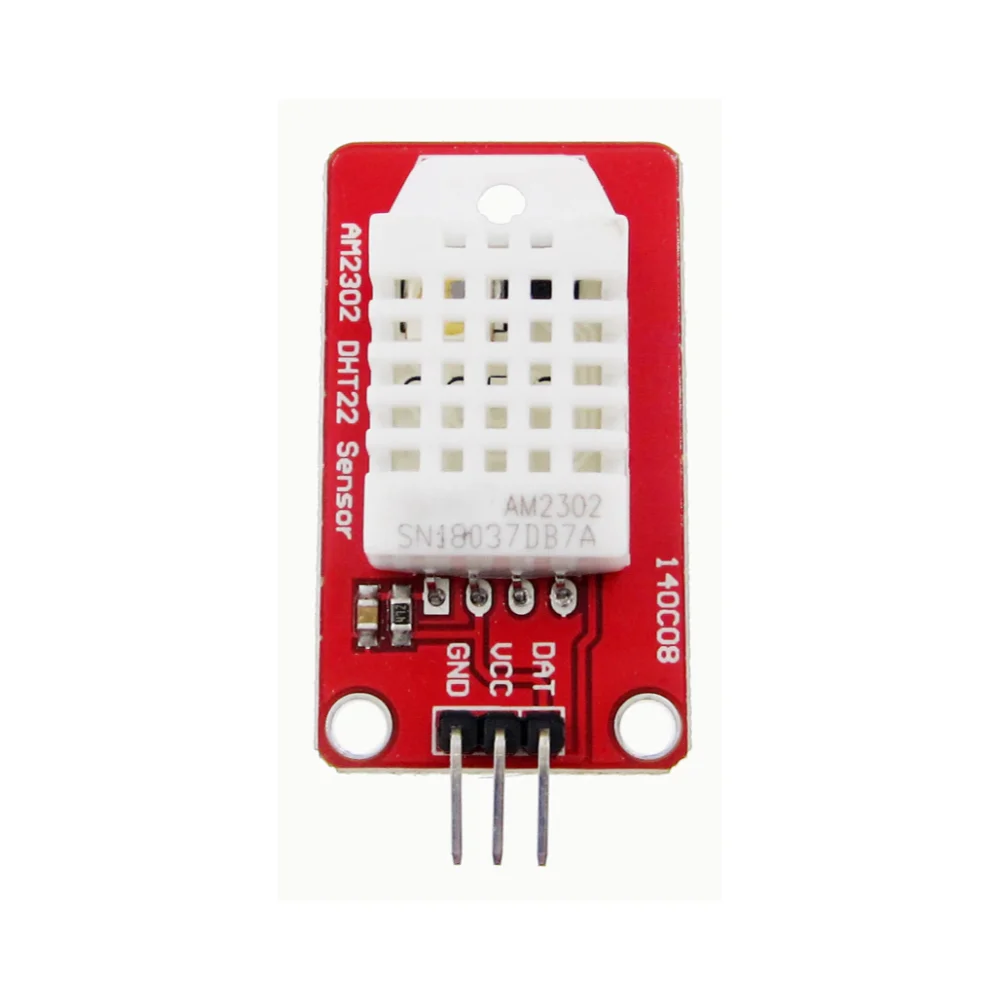
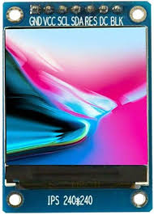
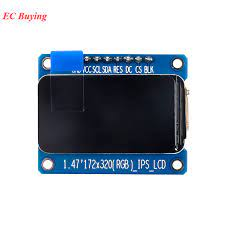
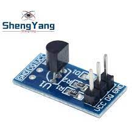
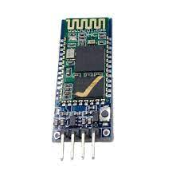
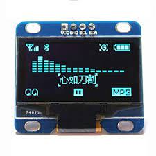

# Para el futuro

| Producto                                           | Link                                                                                                         |    Precio |
|----------------------------------------------------|--------------------------------------------------------------------------------------------------------------|----------:|
| **Creality** Ender-3 S1                            | [ver](https://www.pcfactory.cl/producto/45683-creality-ender-3-s1)                                           | $ 399.990 |
| **Creality** Modulo Láser CV                       | [ver](https://www.todotoner.cl/en/impresoras/impresoras-3d/repuestos-3d/modulo-laser-cv-ender-3-s1-creality) |  $ 68.738 |
| **Creality** Filamento PLA Negro para Impresión 3D | [ver](https://www.pcfactory.cl/producto/31156-creality-filamento-pla-negro-para-impresion-3d)                |  $ 21.990 |

## Ultimas adquisiciones

| Componente                                                                                                                                                                                                                                   | Imagen referencial                               |  Valor |
|----------------------------------------------------------------------------------------------------------------------------------------------------------------------------------------------------------------------------------------------|--------------------------------------------------|-------:|
| [Módulo de Sensor Digital de temperatura y humedad AM2302 DHT22](https://es.aliexpress.com/item/1005003332920736.html?spm=a2g0o.order_list.order_list_main.5.21ef194dbpEyvs&gatewayAdapt=glo2esp)                                            |    | $2.802 |
| [Módulo de pantalla TFT LCD IPS a Color, 1,69 pulgadas, ST7789, 1,69x240](https://es.aliexpress.com/item/1005005742439175.html?spm=a2g0o.order_detail.order_detail_item.4.71c539d32rrAcd&gatewayAdapt=glo2esp)                               |  | $3.676 |
| [Módulo LCD de pantalla IPS de 1,47 "y 1,47", interfaz SPI ST7789, controlador 172X320, Color, 172x320](https://es.aliexpress.com/item/1005005724628042.html?spm=a2g0o.order_detail.order_detail_item.7.71c539d32rrAcd&gatewayAdapt=glo2esp) |  | $3.176 |
| [Módulo de Sensor de medición de temperatura para Arduino, DS18B20, 5 piezas/1 unidad](https://es.aliexpress.com/item/1005005106787442.html?spm=a2g0o.order_list.order_list_main.17.21ef194dbpEyvs&gatewayAdapt=glo2esp)                     |         | $2.104 |
| [Módulo bluetooth integrado maestro-esclavo de HC-05](https://es.aliexpress.com/item/1005005430346960.html?spm=a2g0o.order_list.order_list_main.23.21ef194dbpEyvs&gatewayAdapt=glo2esp)                                                      |           | $3.266 |
| [Módulo de pantalla serie OLED IIC de 0,96 pulgadas](https://es.aliexpress.com/item/1005004088915992.html?spm=a2g0o.order_list.order_list_main.29.21ef194dbpEyvs&gatewayAdapt=glo2esp)                                                       |    | $2.926 |