# Componentes opcionales / avanzados

| Componente                                                                                                          | Imagen referencial                                                    | Valor   |
|---------------------------------------------------------------------------------------------------------------------|-----------------------------------------------------------------------|---------|
| [Imán de Neodimio 8×1.5mm N50](https://www.mechatronicstore.cl/iman-de-neodimio-8x1-5mm-n50/)                       |                                | $ 350   |
| [Resistencias variables trimmer](https://www.mechatronicstore.cl/kit-100-resistencias-variables-trimmer10-valores/) | 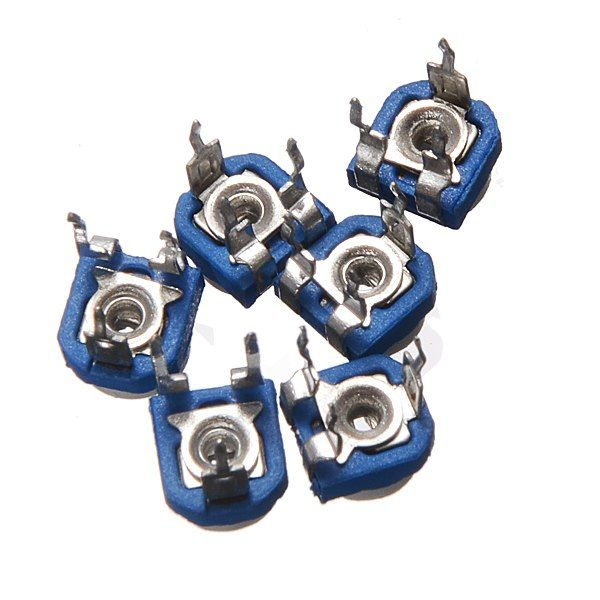                | $8.900  |
| [Resistencias](https://www.mechatronicstore.cl/pack-600-resistencias/)                                              | 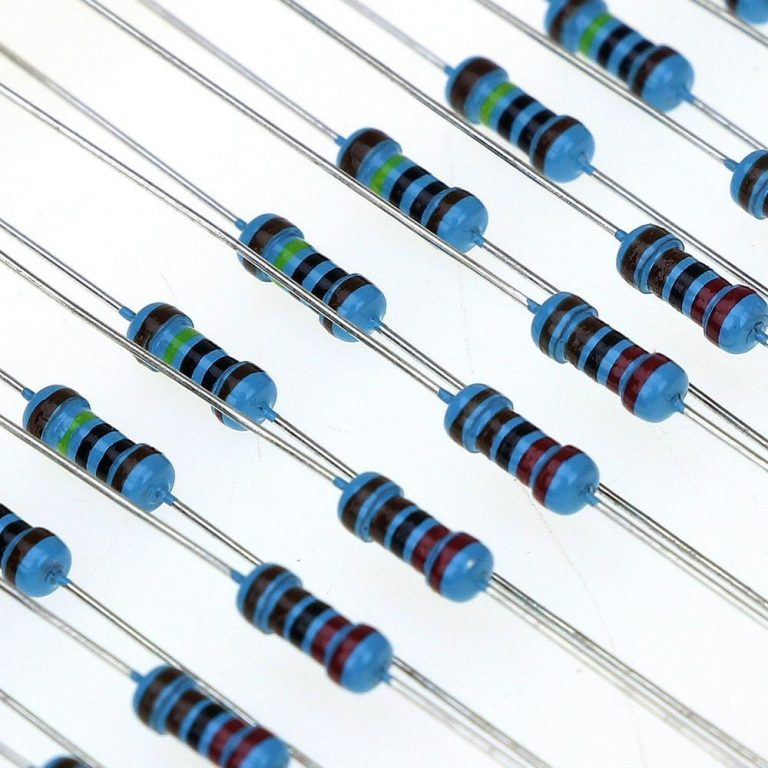                        | $5.990  |
| [LDR sensor de luz](https://www.mechatronicstore.cl/fotoresistencia-ldr-5mm/)                                       | 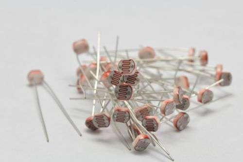                           | $350    |
| [Perilla cubre potenciometro](https://www.mechatronicstore.cl/perilla-potenciometro-colores/)                       | 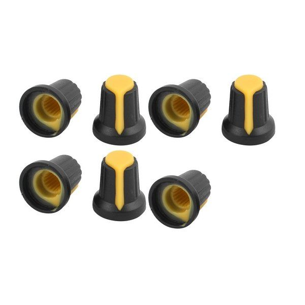                 | $200    |
| [Switch ON OFF](https://www.mechatronicstore.cl/switch-on-off-retroiluminado-blanco-azul-con-simbolo/)              | 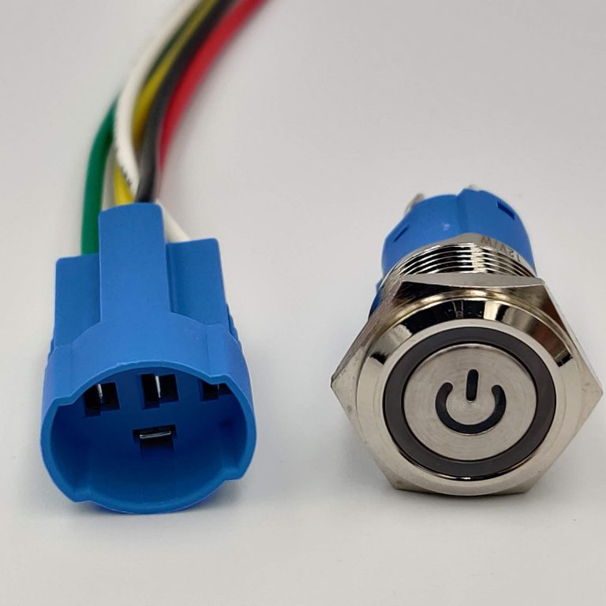 | $4.490  |
| [Interruptor de palanca](https://www.mechatronicstore.cl/interruptor-de-palanca-3-posiciones-on-off-on/)            | 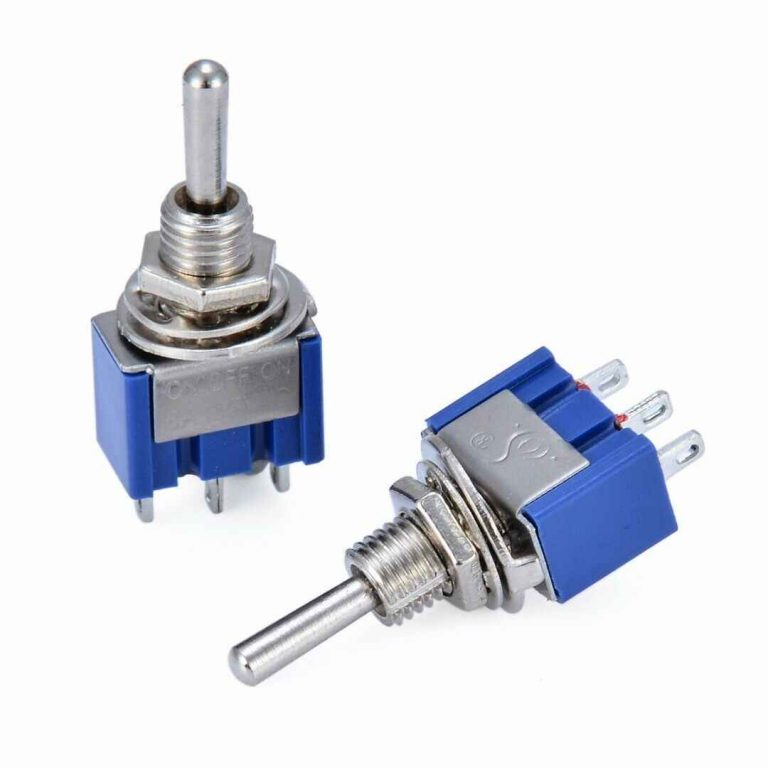                  | $790    |
| [Interruptor tipo Rocker 2 posiciones](https://www.mechatronicstore.cl/interruptor-tipo-rocket-2-posiciones/)       | 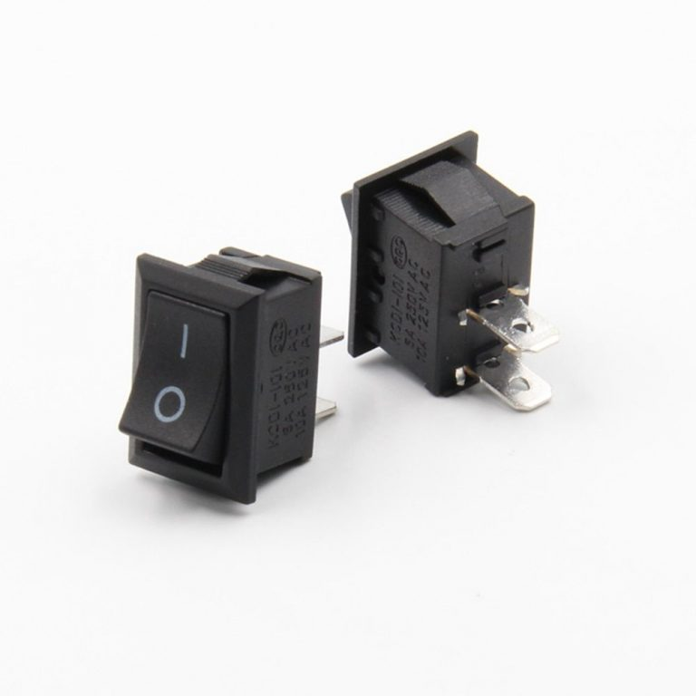                  | $590    |
| [Separadores M3](https://www.mechatronicstore.cl/kit-120-espaciadores-m25/)                                         | 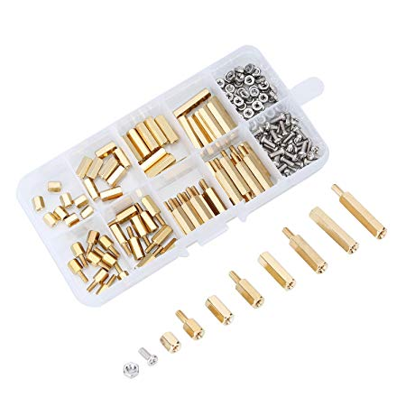                       | $11.500 |
| [60 Pernos hexagonales](https://www.mechatronicstore.cl/60-pernos-hexagonales-de-nylon-con-tornillo-y-tuerca-m3/)   | 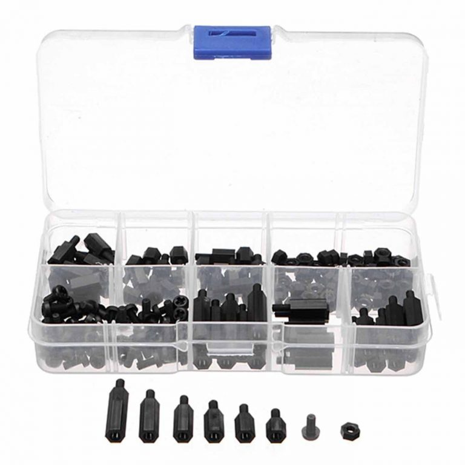                           | $5.890  |
| [20 piezas Tornillo M3 con tuerca](https://www.mechatronicstore.cl/20-piezas-tornillo-m3-con-tuerca/)               | 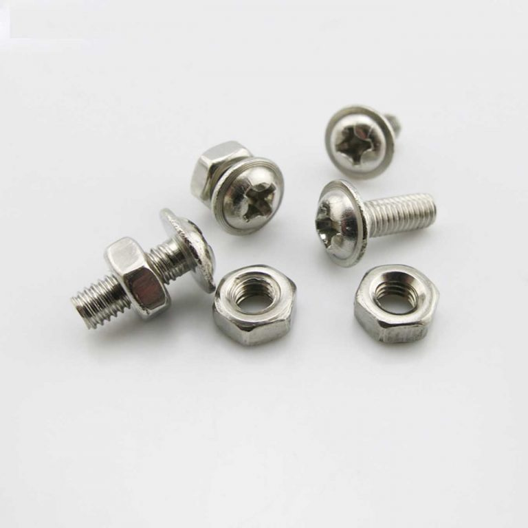                            | $1.490  |
| [Cable Conector Cocodrilo](https://www.mechatronicstore.cl/cable-conector-cocodrilo-10-unidades/)                   | 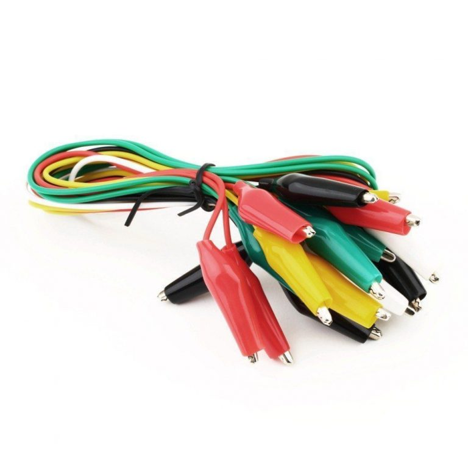                   | $2.490  |
| [Kit de poleas](https://www.mechatronicstore.cl/pack-engranajes/)                                                   | 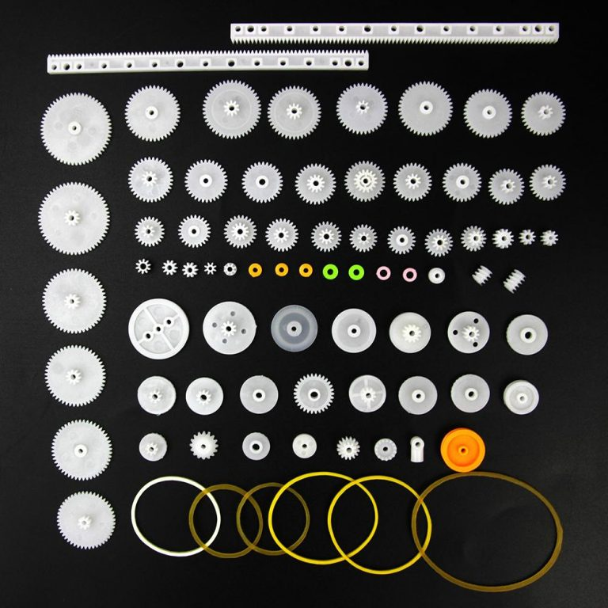                              | $5.400  |