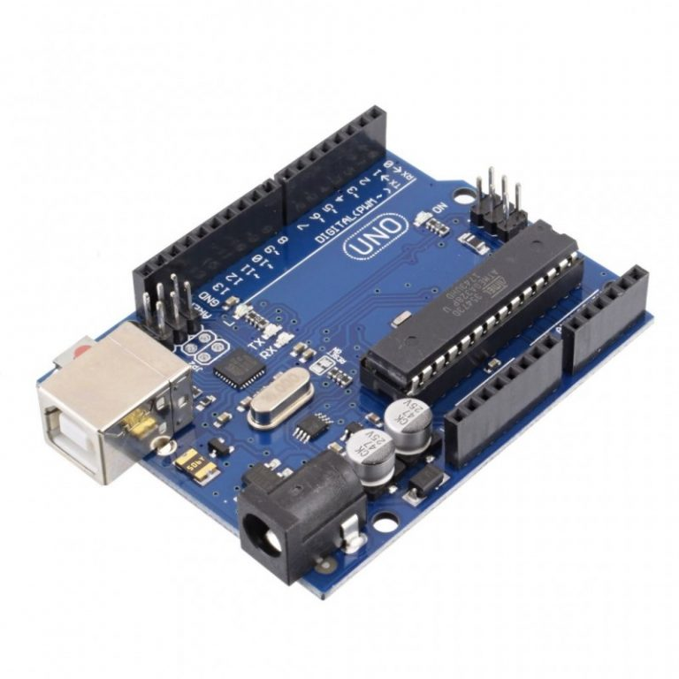
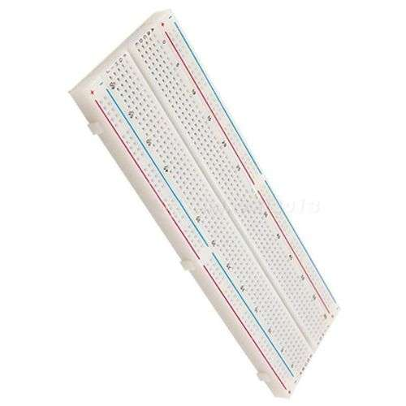
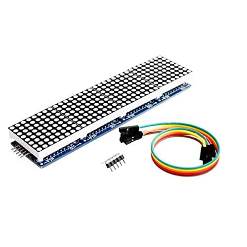
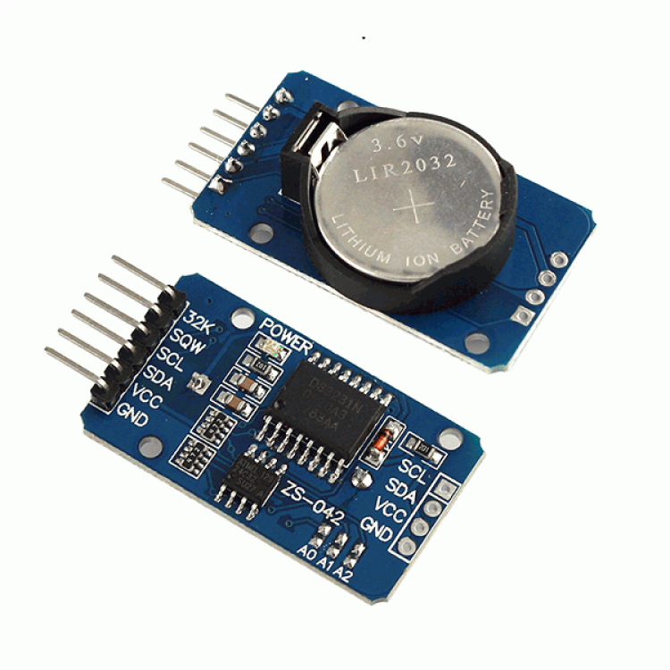

# Arduino

## Repo GIT

```shell
git clone https://github.com/silverfox78/SendaArduino.git
```

## Objetivo

La idea es crear un reloj simpatico que fuera de dar la hora, entrege la temperatura, humedad y sea un control bluetooth para la musica.
Tambien es posible que le sume algunos detalles adicionales.

Para este objetivo, ire avanzando poco a poco en los pasos necesarios para llegar a esto.

## Componentes iniciales

| Componente                                                                                                                              | Imagen referencial                               |   Valor |
|-----------------------------------------------------------------------------------------------------------------------------------------|--------------------------------------------------|--------:|
| [Arduino Uno R3 ](https://www.mechatronicstore.cl/arduino-uno-r3/)                                                                      |  | $15.690 |
| [Protoboard](https://www.mechatronicstore.cl/breadboard-830-puntos-mb102/)                                                              |      | $ 2.490 |
| [Matriz led 32x8 operado con un MAX7219](https://www.mechatronicstore.cl/Fmatriz-led-8x8x4-256-leds-max7219/)                           |         |  $6.890 |
| [Módulo Reloj RTC DS3231](https://www.mechatronicstore.cl/modulo-reloj-rtc-ds3231/)                                                     |          |  $3.490 |
| [Pila CR2032 o CR2040](https://articulo.mercadolibre.cl/MLC-956407083-pack-tira-5-pilas-tipo-boton-duracell-dlcr-2032-_JM )(5 unidades) |          |  $3.325 |

## Proyectos iniciales

| N | Titulo                                      | Descripcion                                                                                                                                                                         |
|---|---------------------------------------------|-------------------------------------------------------------------------------------------------------------------------------------------------------------------------------------|
| 1 | [Seteo del reloj](p001_reloj_set/readme.md) | Como dice el titulo, es necesario que fijemos la hora en el reloj que usaremos, pero para su uso cotidiano no sera necesario, por eso lo descomponemos en un proyecto independiente |

-----

### Para el futuro

| Producto                                           | Link                                                                                                         |    Precio |
|----------------------------------------------------|--------------------------------------------------------------------------------------------------------------|----------:|
| **Creality** Ender-3 S1                            | [ver](https://www.pcfactory.cl/producto/45683-creality-ender-3-s1)                                           | $ 399.990 |
| **Creality** Modulo Láser CV                       | [ver](https://www.todotoner.cl/en/impresoras/impresoras-3d/repuestos-3d/modulo-laser-cv-ender-3-s1-creality) |  $ 68.738 |
| **Creality** Filamento PLA Negro para Impresión 3D | [ver](https://www.pcfactory.cl/producto/31156-creality-filamento-pla-negro-para-impresion-3d)                |  $ 21.990 |