# Arduino

## Repo GIT

```shell
git clone https://github.com/silverfox78/SendaArduino.git
```

## Objetivo

La idea es crear un reloj simpatico que fuera de dar la hora, entrege la temperatura, humedad y sea un control bluetooth para la musica.
Tambien es posible que le sume algunos detalles adicionales.

Para este objetivo, ire avanzando poco a poco en los pasos necesarios para llegar a esto.

## Componentes iniciales

| Componente                                                                                                                               | Imagen referencial                                                         |   Valor |   | Componente                                                                                                                                | Imagen referencial                                      |  Valor |
|------------------------------------------------------------------------------------------------------------------------------------------|----------------------------------------------------------------------------|--------:|---|-------------------------------------------------------------------------------------------------------------------------------------------|---------------------------------------------------------|-------:|
| [Arduino Uno R3 ](https://www.mechatronicstore.cl/arduino-uno-r3/)                                                                       |                            | $15.690 |   | [Protoboard](https://www.mechatronicstore.cl/breadboard-830-puntos-mb102/)                                                                |             | $2.490 |
| [Fuente de Poder](https://maxelectronica.cl/fuentes-de-alimentacion/54-mini-fuente-de-poder-para-protoboard-con-salida-de-33v-y-5v.html) | 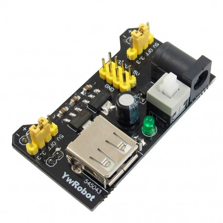                          |  $2.990 |   | [Broche de batería 9V](https://www.mechatronicstore.cl/broche-de-bateria-9v-con-plug-dc-2-1mm/)                                           |  |   $490 |
| [Bateria 9v](https://www.mercadolibre.cl/baterias-alcalinas-duracell-coppertop-blister-9v/p/MLC19902480)                                 | 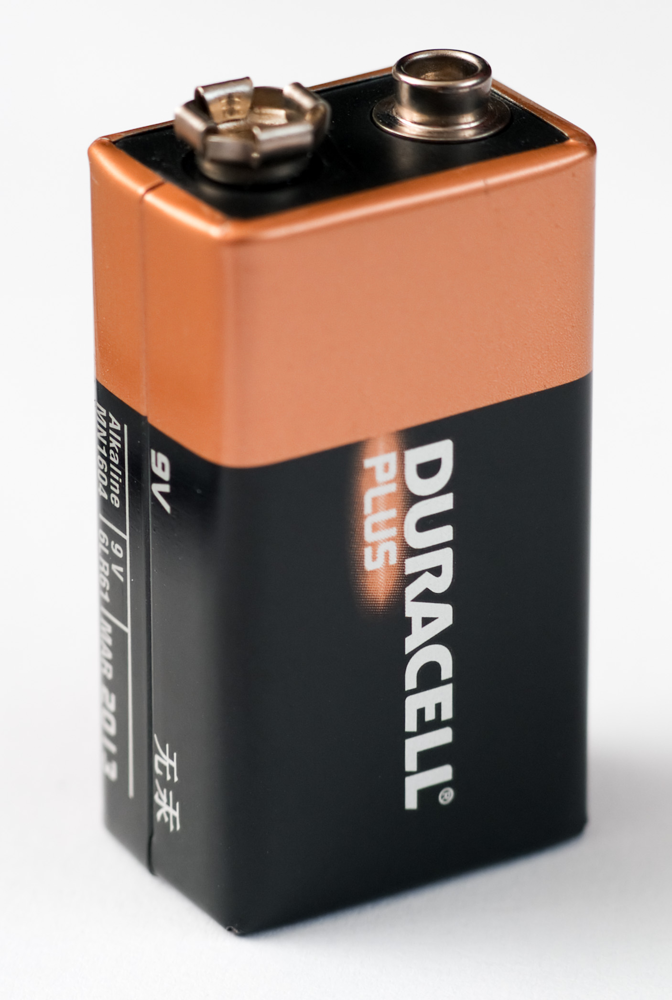                                |  $4.690 |   | [Matriz led 32x8 operado con un MAX7219](https://www.mechatronicstore.cl/Fmatriz-led-8x8x4-256-leds-max7219/)                             |                | $6.890 |
| [Módulo Reloj RTC DS3231](https://www.mechatronicstore.cl/modulo-reloj-rtc-ds3231/)                                                      |                                    |  $3.490 |   | [Pila CR2032 o CR2040](https://articulo.mercadolibre.cl/MLC-956407083-pack-tira-5-pilas-tipo-boton-duracell-dlcr-2032-_JM) - (5 unidades) |                | $3.325 |
| [Kit 6 Pinzas](https://www.mechatronicstore.cl/kit-6-pinzas-antimagneticas-antiestaticas-vetus/)                                         |                                    | $11.900 |   | [Limpiador para cautín](https://www.mechatronicstore.cl/limpiador-para-cautin/)                                                           |                 | $3.490 |
| [Kit de soldadura](https://www.mechatronicstore.cl/kit-de-soldadura-fina-con-cautin-regulable-pelacable-estano-y-mas/)                   |  | $14.990 |   | [Estaño soldadura](https://www.mechatronicstore.cl/rollo-soldadura-100g-1mm-40-60/)                                                       | 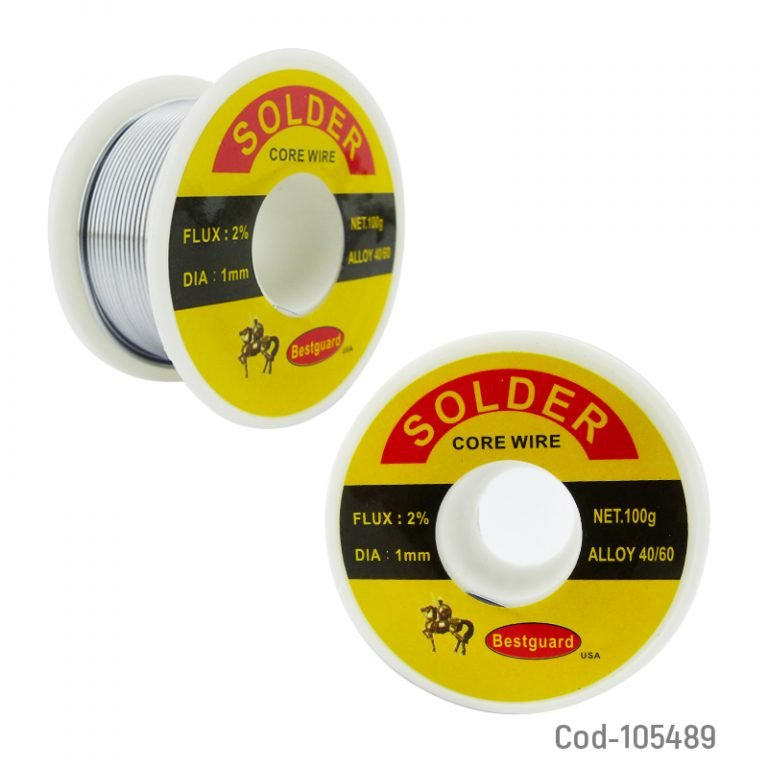                | $4.990 |
| [Cable H/H 10 cm](https://www.mechatronicstore.cl/cable-hembra-hembra-40-piezas-10-cm/)                                                  | 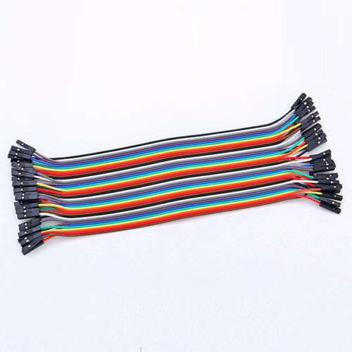                                  |  $1.990 |   | [Cable H/H 20 cm](https://www.mechatronicstore.cl/cables-hembra-hembra-40-piezas-20cm/)                                                   |                | $2.390 |
| [Cable M/H 10 cm](https://www.mechatronicstore.cl/cable-macho-hembra-40-piezas-10-cm/)                                                   | 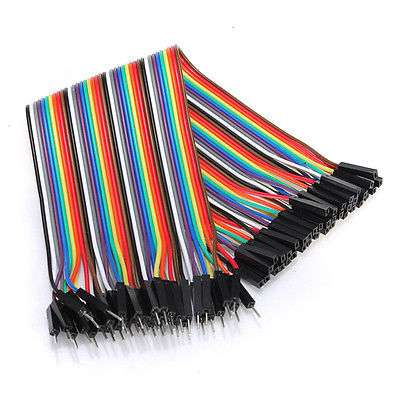                                  |  $1.990 |   | [Cable M/H 20 cm](https://www.mechatronicstore.cl/cable-macho-hembra-40-piezas-20-cm/)                                                    |                | $2.390 |
| [Cable M/M 10 cm](https://www.mechatronicstore.cl/cable-macho-macho-40-piezas-10cm/)                                                     |                                   |  $1.590 |   | [Cable M/M 20 cm](https://www.mechatronicstore.cl/cable-macho-macho-40-piezas-20cm/)                                                      |                | $2.500 |

-----

## Proyectos iniciales

| N | Titulo                                      | Descripcion                                                                                                                                                                         |
|---|---------------------------------------------|-------------------------------------------------------------------------------------------------------------------------------------------------------------------------------------|
| 1 | [Seteo del reloj](p001_reloj_set/readme.md) | Como dice el titulo, es necesario que fijemos la hora en el reloj que usaremos, pero para su uso cotidiano no sera necesario, por eso lo descomponemos en un proyecto independiente |

-----

### Opcionales a considerar

| Componente                                                                                                          | Imagen referencial                                                    | Valor   |
|---------------------------------------------------------------------------------------------------------------------|-----------------------------------------------------------------------|---------|
| [Imán de Neodimio 8×1.5mm N50](https://www.mechatronicstore.cl/iman-de-neodimio-8x1-5mm-n50/)                       | 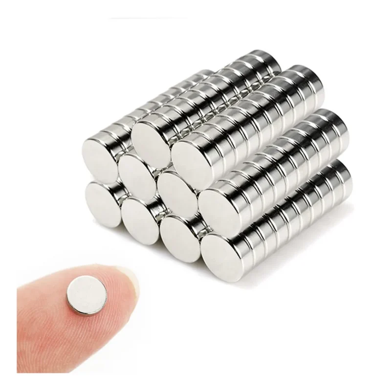                               | $ 350   |
| [Resistencias variables trimmer](https://www.mechatronicstore.cl/kit-100-resistencias-variables-trimmer10-valores/) |                 | $8.900  |
| [Resistencias](https://www.mechatronicstore.cl/pack-600-resistencias/)                                              | 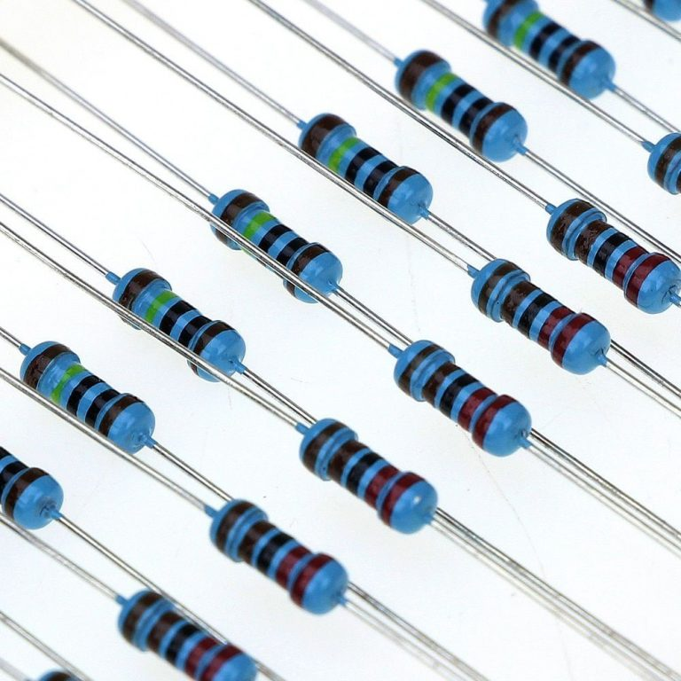                        | $5.990  |
| [LDR sensor de luz](https://www.mechatronicstore.cl/fotoresistencia-ldr-5mm/)                                       | 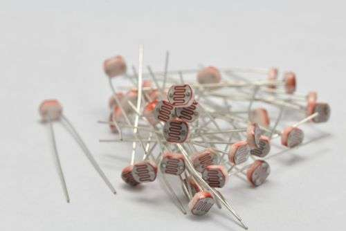                           | $350    |
| [Perilla cubre potenciometro](https://www.mechatronicstore.cl/perilla-potenciometro-colores/)                       |                  | $200    |
| [Switch ON OFF](https://www.mechatronicstore.cl/switch-on-off-retroiluminado-blanco-azul-con-simbolo/)              |  | $4.490  |
| [Interruptor de palanca](https://www.mechatronicstore.cl/interruptor-de-palanca-3-posiciones-on-off-on/)            |                   | $790    |
| [Interruptor tipo Rocker 2 posiciones](https://www.mechatronicstore.cl/interruptor-tipo-rocket-2-posiciones/)       |                   | $590    |
| [Separadores M3](https://www.mechatronicstore.cl/kit-120-espaciadores-m25/)                                         | 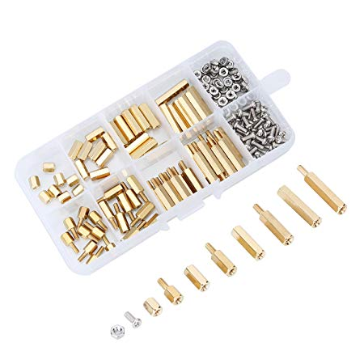                       | $11.500 |
| [60 Pernos hexagonales](https://www.mechatronicstore.cl/60-pernos-hexagonales-de-nylon-con-tornillo-y-tuerca-m3/)   | 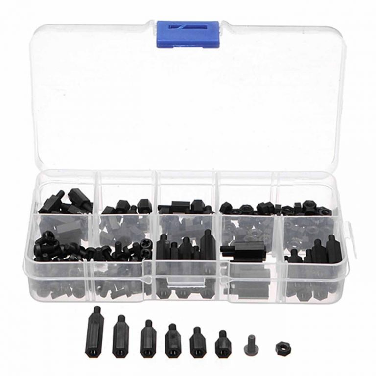                           | $5.890  |
| [20 piezas Tornillo M3 con tuerca](https://www.mechatronicstore.cl/20-piezas-tornillo-m3-con-tuerca/)               |                             | $1.490  |
| [Cable Conector Cocodrilo](https://www.mechatronicstore.cl/cable-conector-cocodrilo-10-unidades/)                   | 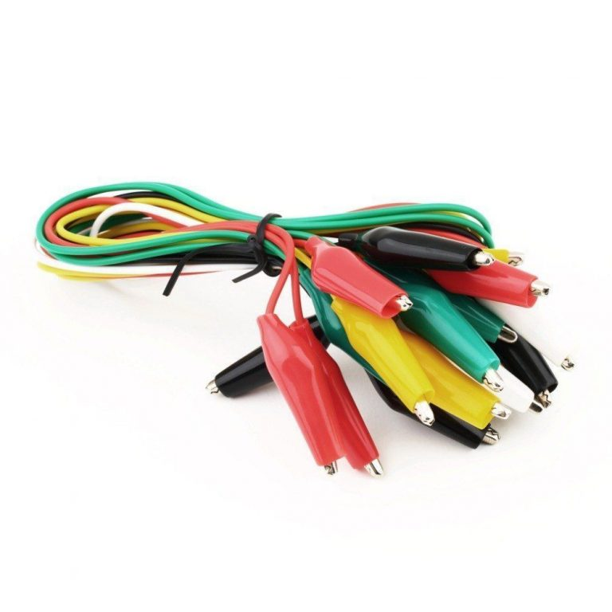                   | $2.490  |
| [Kit de poleas](https://www.mechatronicstore.cl/pack-engranajes/)                                                   |                               | $5.400  |


### Para el futuro

| Producto                                           | Link                                                                                                         |    Precio |
|----------------------------------------------------|--------------------------------------------------------------------------------------------------------------|----------:|
| **Creality** Ender-3 S1                            | [ver](https://www.pcfactory.cl/producto/45683-creality-ender-3-s1)                                           | $ 399.990 |
| **Creality** Modulo Láser CV                       | [ver](https://www.todotoner.cl/en/impresoras/impresoras-3d/repuestos-3d/modulo-laser-cv-ender-3-s1-creality) |  $ 68.738 |
| **Creality** Filamento PLA Negro para Impresión 3D | [ver](https://www.pcfactory.cl/producto/31156-creality-filamento-pla-negro-para-impresion-3d)                |  $ 21.990 |